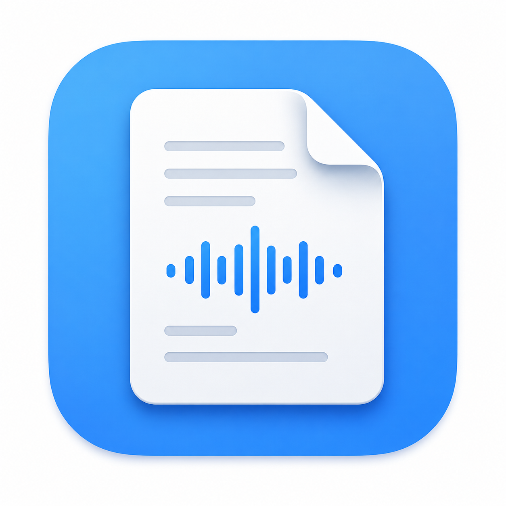

# Transnote

macOS 向けのオンデバイス文字起こしアプリ。ローカルの音声ファイルを WhisperKit で処理し、結果を画面表示・エクスポートする。音声データは端末内で完結し、クラウドへ送信しない。Whisper モデルの初回ダウンロード時のみネットワークを使用する。

内部アプリ名は LocalTranscriber、公開名は Transnote。現在のバージョンは **v0.1.0**。

<p align="center">
  
</p>

## ダウンロード

| 方法 | リンク |
| --- | --- |
| 最新版 DMG | [GitHub Releases (latest)](https://github.com/T3pp31/Transnote/releases/latest) |
| 配布ページ | [GitHub Pages](https://t3pp31.github.io/Transnote/) |

### インストール（要約）

未署名配布のため、**インストール.command** はダブルクリックや右クリック → 開く では実行できないことがあります。**ターミナルからの実行が確実です。**

1. DMG を開き、**初めにお読みください.txt** を読む
2. ターミナルで次を1行ずつ実行する:

```bash
xattr -cr "/Volumes/Transnote/"
bash "/Volumes/Transnote/インストール.command"
```

3. DMG を取り出す
4. 初回起動時に Gatekeeper 警告が出た場合は、右クリック → 開く
5. 初回利用時に Whisper モデルをダウンロードする

詳細は [docs/install.md](docs/install.md) を参照。

## 主要機能

| 機能 | 説明 |
| --- | --- |
| ファイル選択・ドラッグ&ドロップ | wav / mp3 / m4a / flac に対応 |
| オンデバイス文字起こし | WhisperKit によるローカル処理 |
| モデル選択・ダウンロード | Tiny / Base / Small / Large v3 Turbo (compressed) / Large v3 Turbo |
| 言語選択 | Auto / Japanese / English |
| 進捗表示・キャンセル | 準備中〜文字起こし中の各フェーズを表示 |
| 結果表示・編集・コピー | 文字起こし結果をその場で編集可能 |
| セグメント再生 | タイムスタンプ付きセグメントの音声再生 |
| エクスポート | TXT / Markdown / JSON / SRT / VTT |
| アップデート確認 | 起動時に GitHub Releases を確認 |

## プライバシー

- 音声ファイルの内容は端末内で処理され、外部サーバーへ送信されない
- ネットワークは Whisper モデルのダウンロードとアップデート確認時のみ使用する
- App Sandbox 上で動作する

## ステータス

| 項目 | 状態 |
| --- | --- |
| バージョン | v0.1.0 |
| 実装 | SwiftUI アプリ、テスト、CI 稼働中 |
| 配布 | 未署名 DMG（GitHub Actions → GitHub Releases / Pages） |

### 今後の予定

| バージョン | 内容 |
| --- | --- |
| v0.3 | 履歴、設定画面、長時間音声対応 |
| v0.4 | モデル管理の強化、エラー処理の改善 |
| v1.0 | 配布導線の安定化（署名は任意） |
| v1.1 | 動画対応、話者分離、録音 |

詳細は [docs/roadmap.md](docs/roadmap.md) を参照。

## 技術スタック

| 領域 | 技術 |
| --- | --- |
| UI | SwiftUI |
| 文字起こし | [WhisperKit](https://github.com/argmaxinc/argmax-oss-swift) 0.9.0+ |
| 音声処理 | AVFoundation |
| 設定 | `Config/Defaults.plist` + UserDefaults |
| データ永続化 | ファイルシステム（`~/Library/Application Support/LocalTranscriber/`） |
| テスト | XCTest |
| CI/CD | GitHub Actions（macOS 15, Xcode 16.4） |
| 配布 | 未署名 DMG + `インストール.command` |

Python や Rust は採用しない。Xcode プロジェクトの再生成に Python 3 を使用する。

## 要件

| 項目 | バージョン |
| --- | --- |
| macOS | 14.0 以降 |
| Xcode | 16.0 以降（CI は 16.4） |

WhisperKit は `argmaxinc/argmax-oss-swift` の Swift Package として提供される。前提環境は公式 README に準拠する。

## プロジェクト構成

```text
Transnote/
├── LocalTranscriber/       # アプリ本体（Domain / Services / Presentation）
├── LocalTranscriberTests/  # 単体・統合テスト
├── Config/                 # アプリ設定・配布設定
├── docs/                   # 設計・運用ドキュメント
├── scripts/                # ビルド・配布スクリプト
├── site/                   # GitHub Pages ランディング
└── .github/workflows/      # CI / Release / Pages
```

## 開発者向けビルド

```bash
# Xcode プロジェクトを再生成する場合
python3 scripts/generate_xcodeproj.py

# テスト（署名なし）
xcodebuild test \
  -project LocalTranscriber.xcodeproj \
  -scheme LocalTranscriber \
  -destination 'platform=macOS' \
  CODE_SIGNING_ALLOWED=NO \
  -derivedDataPath DerivedData

# Debug ビルド
xcodebuild build \
  -project LocalTranscriber.xcodeproj \
  -scheme LocalTranscriber \
  -configuration Debug \
  -destination 'platform=macOS' \
  CODE_SIGNING_ALLOWED=NO
```

Release ビルドと DMG 作成は `v*.*.*` タグの push で GitHub Actions が自動実行する。未署名配布のため GitHub Secrets は不要。運用詳細は [docs/distribution.md](docs/distribution.md) を参照。

## ドキュメント

| ファイル | 内容 |
| --- | --- |
| [docs/install.md](docs/install.md) | エンドユーザー向けインストール手順 |
| [docs/distribution.md](docs/distribution.md) | Release ビルド・DMG 配布の運用 |
| [docs/architecture.md](docs/architecture.md) | アプリ構成、モジュール設計、画面設計 |
| [docs/roadmap.md](docs/roadmap.md) | 実装フェーズ、スケジュール、拡張計画 |
| [docs/spec-v0.1.md](docs/spec-v0.1.md) | v0.1 の仕様とスコープ |

## 参考リンク

- [WhisperKit（argmax-oss-swift）](https://github.com/argmaxinc/argmax-oss-swift) — Swift Package、モデル管理、文字起こし API
- [WhisperKit ドキュメント](https://www.mintlify.com/explore/argmaxinc/WhisperKit) — ストリーミング、VAD、タイムスタンプ
- [macOS App Sandbox でのファイルアクセス](https://developer.apple.com/documentation/security/accessing-files-from-the-macos-app-sandbox) — Security-scoped bookmark 設計の参考
- [Developer ID](https://developer.apple.com/support/developer-id/) — Mac App Store 外配布時の署名・公証
